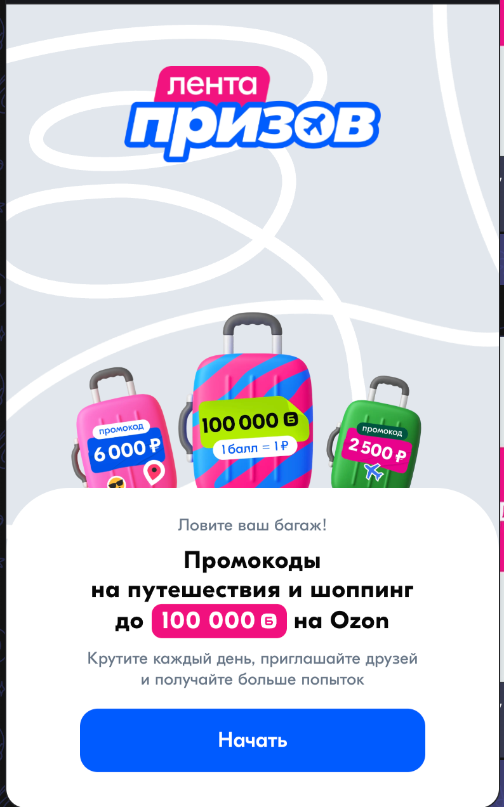
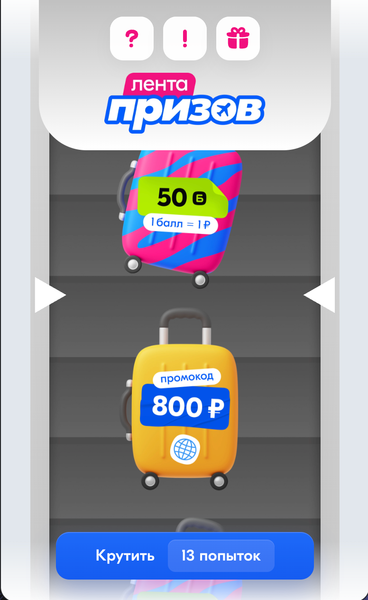
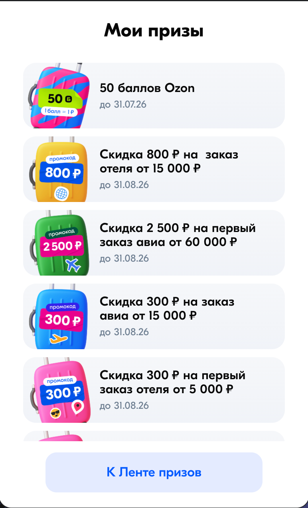
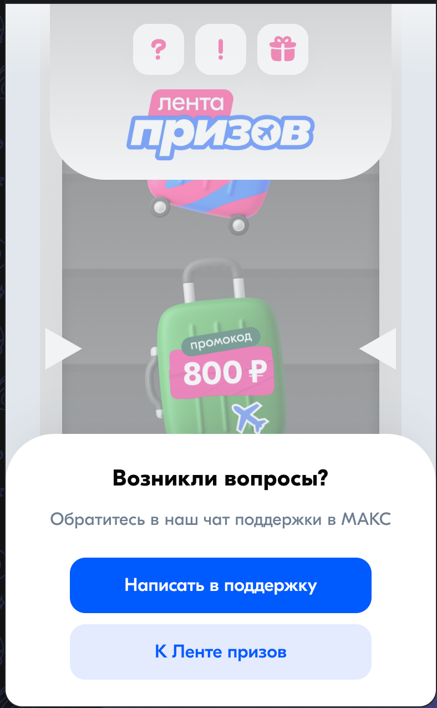

# Ozon Travel Prize Feed

Full-stack promotional mini app for the MAX messenger with a gamified prize flow, bot onboarding, referral mechanics, admin operations, and background messaging infrastructure.

## Project Snapshot

Ozon Travel Prize Feed is a campaign product built around a simple idea: make a promo experience feel like a game, while keeping reward distribution operationally safe and fully auditable.

Users enter from a MAX bot, confirm channel subscription, open the mini app, spin a roulette-style prize feed, collect rewards, and return daily for additional attempts. Behind the scenes, the system manages promo-code inventory, logs every user action, supports referral bonuses, and gives the operations team tools to control prizes, monitor users, and handle support cases.

## What Makes This Project Strong

- It combines consumer-facing UX and internal tooling in one product
- It is not just a frontend demo, but a full working system with real business logic
- It solves both engagement and operations problems
- It includes bot integration, background jobs, admin workflows, and audit-ready persistence

## My Focus Areas

This project demonstrates work across:

- product-oriented frontend engineering
- backend API and state management
- relational data design
- promo-code inventory handling
- operational admin tooling
- bot and mini-app integration
- worker-based automation

## Product Experience

The player journey is intentionally compact:

1. User opens the MAX bot
2. Bot verifies subscription readiness
3. Mini app launches into the campaign flow
4. User spins the prize feed using available attempts
5. Reward is stored and shown in prize history
6. User returns through daily re-engagement and referrals

That makes the experience easy to understand for the player, while still giving the business several engagement loops:

- repeat opens
- referral invites
- prize collection
- support/contact recovery

## Engineering Challenges Solved

### 1. Making rewards safe to issue

Promo campaigns break quickly if reward issuance is ambiguous. This project separates:

- prize definitions
- awarded prizes
- promo-code pools
- attempt transactions
- gameplay logs

That structure helps prevent silent failures and makes support investigation much easier.

### 2. Keeping the game feel while preserving deterministic results

The roulette UI feels playful, but the actual outcome is backend-driven. The frontend animation presents the backend-selected result instead of inventing its own. This keeps the experience visually engaging without sacrificing auditability.

### 3. Handling limited reward pools

Some prizes are backed by finite promo-code inventories. The project supports claiming codes from a managed pool at reward time, which is essential for real promotional operations.

### 4. Supporting operations after launch

Campaigns need more than gameplay. This system also includes tools for:

- viewing logs
- inspecting player history
- managing prizes
- uploading and scheduling promo-code pools
- deleting users when support cases require it

That makes the project much closer to a real production system than a standalone mini app.

### 5. Automating engagement loops

Daily attempts, reminders, and notification flows are handled by background services rather than manual actions. This is important because campaign retention depends on repeatable automation.

## Architecture

### Frontend

- React 19
- Vite
- Tailwind CSS 4

### Admin

- React
- Chakra UI
- Vite

### Backend and Infra

- Node.js
- Express
- PostgreSQL
- Redis
- BullMQ
- Docker Compose
- Traefik

### Messaging Layer

- MAX Bot API
- MAX mini app launch flow

## Why It Works Well as a Portfolio Project

This project is a strong portfolio piece because it shows:

- product thinking, not only coding
- UI work and system design in the same repo
- integration with external platforms
- operational awareness
- real data flows and background processing
- support for live campaign maintenance

It tells a better story than a typical CRUD app because it demonstrates how multiple systems work together to support a real promotional product.

## Assets

- Demo video: [demo.mp4](./demo.mp4)
- Detailed technical README: [README.detailed.md](./README.detailed.md)

## Screenshots

### Intro

### Roulette

### Prize history

### Support flow

## Short Portfolio Summary

Ozon Travel Prize Feed is a full-stack campaign platform that blends gamified UX, reward inventory management, bot onboarding, admin operations, and background automation. It is a good example of building not just the visible product surface, but the operational system required to run and support it.
